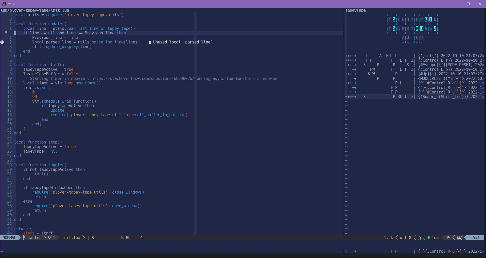

# plover-tapey-tape.nvim

A neovim plugin to help display your latest output from the
[plover tapey tape](https://github.com/rabbitgrowth/plover-tapey-tape)
[Plover](https://github.com/openstenoproject/plover) stenography
plugin.

## Plugin Modes

There are two modes that this plugin can work with:

1. Status line showing the last line of output
2. Buffer split showing live updates and more than one line of output

## Install

Requires neovim version 0.8.0

### Install With Packer

```lua
use('derekthecool/plover-tapey-tape.nvim')
```

### install With Vim Plug

```vim
Plug 'derekthecool/plover-tapey-tape.nvim'
```

## Setup And Usage

Call the setup function with your desired settings.

```lua
require('plover-tapey-tape').setup() -- Use all default settings

require('plover-tapey-tape').setup({ -- Use custom settings (defaults are shown)
    filepath = 'auto',
    open_method = 'vsplit',
    vertical_split_height = 9,
    horizontal_split_width = 54,
    steno_capture = '|(.-)|',
    suggestion_notifications = {
        enabled = true,
    },
    status_line_setup = {
        enabled = true,
        additional_filter = '(|.-|)',
    },
}
```

### Suggested Mappings

No mappings are set by the plugin. Here are some suggested mappings for
available commands.

```lua
vim.keymap.set('n', '<leader>tt', require('plover-tapey-tape').toggle) -- open tape window
vim.keymap.set('n', '<leader>ts', require('plover-tapey-tape').stop) -- stop plugin
```

## Screenshots



[](https://asciinema.org/a/527205)

## Implemented Features

- [x] Enable auto discovery of tapey-tape log file. Supports Linux, WSL,
      Windows, Mac.
- [x] Draw a steno keyboard in realtime that show your keys highlighted
- [x] Show notifications for suggestions
- [x] Autocommand to close file watcher when neovim is closing
- [x] Autocommand to disable autoscrolling when inside tapey-tape log buffer
- [x] Autocommand to enable autoscrolling when outside tapey-tape log buffer
